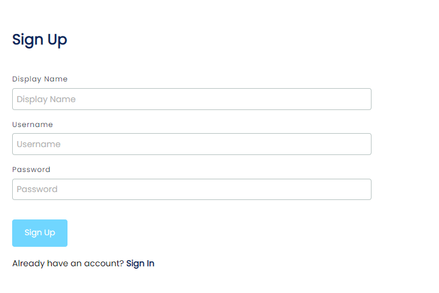
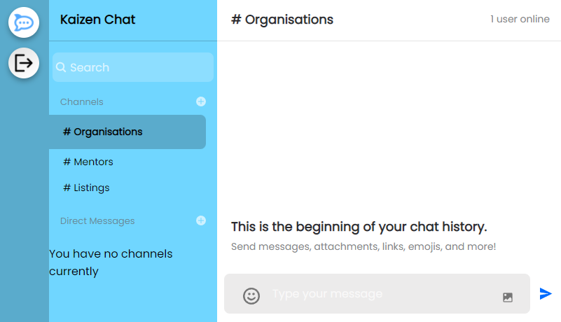
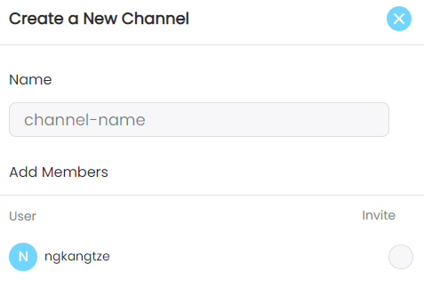
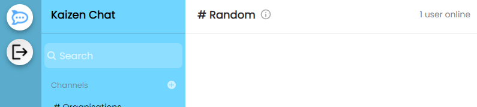
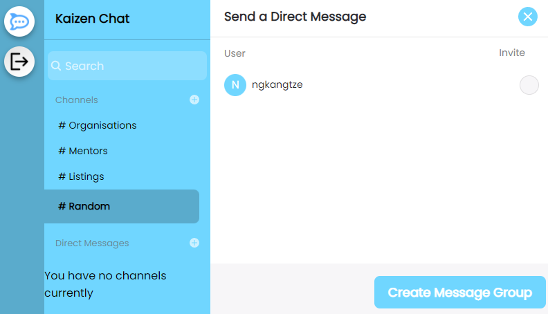
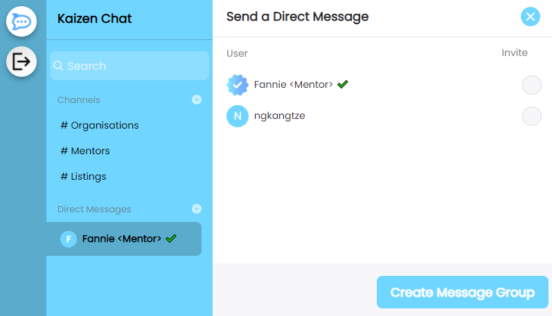

# [Kaizen Web App Prototype - Chat Client](https://kaizen-chatroom.netlify.app/)

## Table of contents

1. [Introduction](#introduction)
2. [Presentation Video](#presentation-video)
3. [Quick Start](#quick-start)
4. [Features](#features)
    - [Creating/Modifying Channels](#creatingmodifying-channels)
    - [Direct Messages](#direct-messages)
    - [Mentors](#mentors)
5. [Credits](#credits-and-api)

## Introduction

The **Kaizen** web application is designed as part of our solution for [Hack For Good (HFG) 2022](https://dsc.comp.nus.edu.sg/hack4good2022), which is a student-run hackathon organised by the [NUS Developer Student Clubs (DSC)](https://dsc.comp.nus.edu.sg/about).

HFG 2022 aims to inspire students to use technology for social causes and address problems provided by NPOs in Singapore.

Our solution aims to address the following problem submitted by [Daughters of Tomorrow (DOT)](https://daughtersoftomorrow.org/):

> How can we get employers to be open and hire women who have less social mobility and may not have access to livelihood opportunities?

DOT is an IPC charity that aims to help women aged 20 to 60 from low-income families (surviving on $200 to $500 per capita per month) reach regular and sustained employment.

## Presentation Video

*Coming soon*

## Quick Start

> Disclaimer: *The web application aims to provide users with a rapidly accessibly prototype that is roughly similar to the proposed solution in the presentation. As such, some features may differ slightly.*

The Kaizen web application is hosted at https://kaizen-chatroom.netlify.app/. The app aims to showcase the Chat function of the presented solution.

Upon accessing the website, new users must register with a Display Name, Username and Password. The password is hashed before being stored into the database.

After logging in, users are directed to the Home Page where they are automatically added to 3 permanent channels: #Organisations, #Mentors and #Listings. *(Note that first time users may need to refresh the page before the new channels load.)*. Users may then proceed to send messages to others.

## Features

### Creating/Modifying Channels

Users may create new channels by clicking on the **+** symbol beside the **Channels** divider. Upon clicking, an interface will appear where users may specify the new channel name (No special characters allowed!) and the users that they want to invite into the channel.

In order to modify a channel, users must go into the channel and click on the **i** symbol beside the channel name. Then, users may add more users to the channel or change the name of the channel.

### Direct Messages

Users may also send direct messages to their Mentors or other users. To do so, simply click on the **+** symbol beside the **Direct Messages** divider and specify the user. Subsequently, a private channel will be created for you and the specified user.

### Mentors

Mentors will be specified on the application with a ✔️ emoji and a verified profile picture in order to prevent confusion and impersonation.

## Credits and API

- [Build and Deploy a Full Stack Realtime Chat Messaging App with Authentication & SMS Notifications - Javascript Mastery](https://www.youtube.com/watch?v=MJzbJQLGehs&t=30s&ab_channel=JavaScriptMastery)
- [Stream.IO](https://getstream.io/)
- [Netlify](https://www.netlify.com/)
- [Heroku](https://www.heroku.com)

This project was bootstrapped with [Create React App](https://github.com/facebook/create-react-app).
